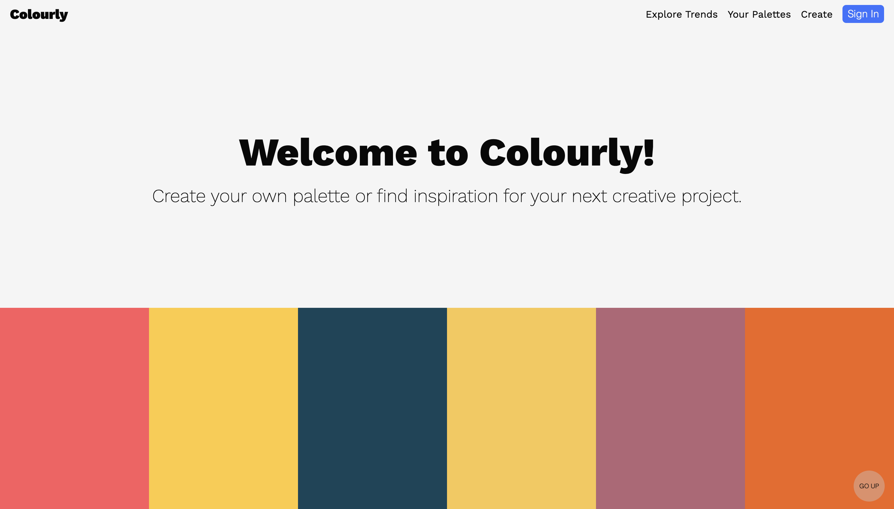

# Colourly

Colourly is a full-stack application inspired by the amazing tool created by [Coolers](https://coolors.co/palettes/trending "Coolers page"). It allows users to create their own colour palettes, see what others have created, save their favourites, delete pelettes, etc. Everyone can see all available palettes, however, to create, save or delete your own pelettes you must sign in or create an account. For the purpose of testing the application, I have offered two test accounts to log in. 

NextJS & MongoDB has been used to create the front end, back end & database. You can view a live deployed version of Colourly [here](https://colourly.vercel.app/ "Deployed version"). 

<!-- However, if you are interested in setting this up on your own machine, I have described the process to do this below. -->

## What can it do?

Colourly was inspired by the amazing tool created by Coolers and only includes a very small subset of the tools Coolers offers. This project was a way for me to practice working with NextJS & MongoDB. This is in no way meant to be a commercially viable product. 

1. You can see all the existing palettes on the home page.
2. You can sign up to create a new account and experiment with this application. You can log in with an existing ID if already signed up. You can also use one of the two test users to log in.
3. For each palette, clicking on the 3 dots will show a menu for that palette that will allow users to see the palette on the full screen, save it or delete it.  
4. Permissions: 
    - Everyone can see all palettes.
    - Signed in users may save or create new palettes.
    - Only users that have created a particular palette, may delete it. 
5. Users may create a new palette via the "Create" page and see their creations on the "Palettes You Created" page. Instructions to create are on the page. Saved palettes can be seen on the "Saved Palettes" page.
<!-- 6. An FAQ page is added to answer some of the common questions and my learning experiences.  -->

## Final Product

1. Home Page

2. Palette - hover on a colour

    
3. Palette - click on a colour
    
    
    
4. Palette - menu 
    
    

<!-- 5. Test users
 -->

5. Sign In / Sign Up

<!-- 7. Menu options when signed in
 -->

6. Create new palette

    

## Dependencies

- bcryptjs 
- body-parser 
- cookie-session 
- dotenv 
- ejs
- express 
- pg 

## Live deployed version
You can view a live deployed version of Colourly [here](https://colourly.vercel.app/ "Deployed version").

<!-- ## Getting Started
Fork and clone this repo to your local machine to begin. Before starting the process, `cd colourly` and install dependencies using the `npm install` command. Since this is a full-stack application I've broken down the setup process in two parts, database and application.

### **Database setup**
First a test database (db) must be created with seed data in it. 

1. Create a .env file in the root of the directory like the .env.example file and add your own db credentials for DB_USER, DB_PASS & DB_NAME 
2. Next, we will need to create the database itself. Start PostgreSQL by using the `psql` command in your CLI.
3. Create the db using `CREATE DATABASE your-db-name;` command, but use the database name you used for the DB_NAME variable in the .env file.
4. If the database credentials are setup properly, you should be able to connect to the db using `\c your-db-name`
5. The database must be initialized with new tables and some seed data next. Add tables to the db using `\i db/schema/01_schema.sql`
6. Add seed data using `\i db/seeds/01_seeds.sql`
7. A few errors that can occur while setting up a PostgreSQL database: 
    - **Role mismatch:** Check existing roles for your machine with \du. If `your-role` you used in the .env file does not exist, it will not show up and you will have to create one with the following command `CREATE ROLE your-role WITH SUPERUSER;`. Note that your current role must be superuser to be able to create a new role.
    - **Password mismatch:** Check how you have set up psql on your machine to sort this one. 
    - **Missing .env file:** You need a .env file with your own credentials to be able to connect to the database. Use the .env.example file to create the .env file.

### **Application setup**

1. Start the web server using the `npm start` command. The app will be served at <http://localhost:3300/>
2. Go to <http://localhost:3300/> in Google Chrome.
3. If the seed data is setup properly, you should be able to see and interact with the application.

## Known issues

These are some of the known issues that exist in this application and I plan on resolving them.

1. Colourly has only been tested in Google Chrome so far therefore behavior could be unexpected in other browsers.
2. The "Create" page has few issues:
  - The selector icons do not maintain position when window is re-sized. A quick refresh fixes the locations again. I am working towards a more robust way to bind them to the colour selector.
  - The bounding range of the selector movement depends on the vertical scroll position. The vertical scroll must be all the way up.
3. No error messages are shown to the user if login fails or if a user tries to delete a palette they did not create. The page simply refreshes. I plan to add more helpful errors for such scenarios. 
4. Currently, any number of palettes may be created with the same colours. A better approach would be to check in the database for a similar combination prior to adding a redundant palette. 
5. The palette menu is not bound to the three dots icon for each palette. It's position does not change with the palette as the window is re-sized. 
6. I would love to improve this project, so if you notice any other features are broken or need improvement, please contact me.
 -->
